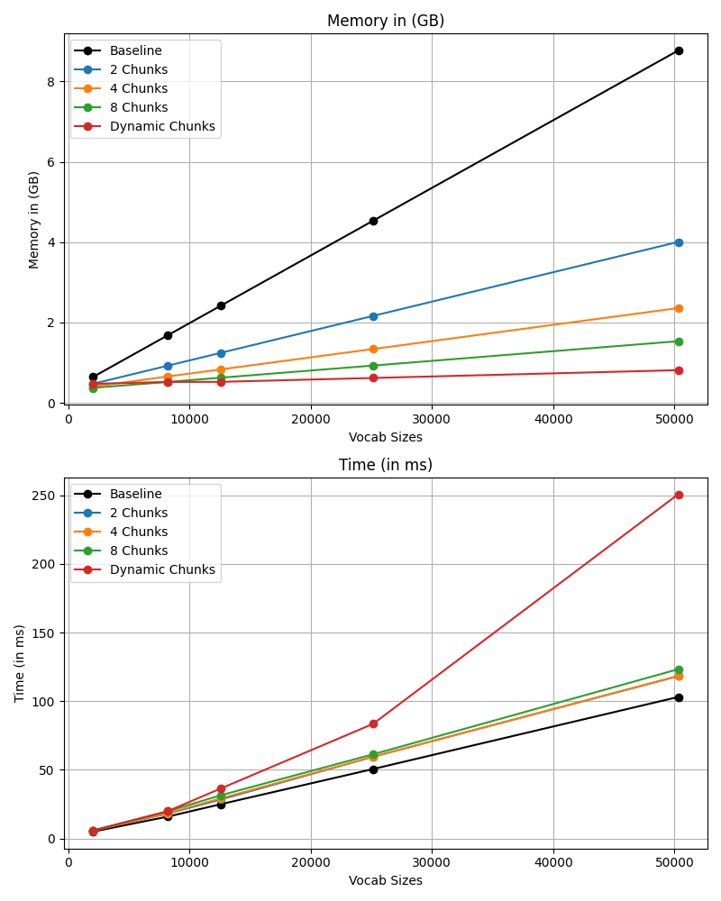

# Fused projection and CE loss
## Explanation
The last operations of LLM's are a projection layer that transforms the embeddings of each token into the logits, a softmax calculation that takes these logits and turns them into probabilities and the cross entropy calculation (loss). Organizations usually publish models in various sizes, however varied these sizes are they all share the same vocabulary size, which means that the projection layer needs to have the same output size.

What this basically means is that, taking Llama as an example (vocab size = 128256), Llama 1B (hidden size = 2048) and Llama 405B (hidden size = 16384), which have very different hidden sizes, will need to allocate the same memory for the logits and softmax calculation.

Fusing the last projection into a single triton kernel and chunking the loss and gradient calculation we can mitigate massively the memory requirement for a negligible cost in performance.

## Results

 

As the figure shows, the larger the vocabulary size the more memory the model uses. By only using 2 chunks we can already reduce the memory requirement by more than 2X, and by chunking more we can keep reducing it. The dynamic chunking is an algorithmic approach that chunks at the pareto optimal limit between memory and time (further reducing the memory allocation would come in an exponential cost of time).

The time spent on calculations is almost equal for all approaches, demonstrating that this fusion a very profitable tradeoff. However, as the vocabulary size increases the dynamic chunking keeps taking more and more time, which makes it only a suitable approach when dealing with very low memory environments or for showing where the optimal frontier is.

## Code
- `modules.py` contains 2 modules, the baseline and the fused versions. The fused module calls an autograd function that implements the forward and backward passes of the operator. The autograd function chunks the input, calls a custom triton kernel that calculates the softmax and the loss and overwrites the logits tensor with the gradients.
- `test.py` contains a simple parametrized test that compares the loss, gradients and dtypes to ensure correctness. (Can be run with `pytest test.py`)
- `reproduce.py` contains the script used to generate the benchmark plot.

## References
In the custom kernel I referenced the algorithm for the online softmax calculation, plus other useful resources.

This was a project done mainly for fun/learning, I owe [mgmalek](https://github.com/mgmalek/efficient_cross_entropy) and [Chillee](https://gist.github.com/Chillee/22cd93e11b887db1f596ab754d60a899) for both the idea and many implementation details.
